# 🧠 MCP Cognitive Observability Agent

**The first observability platform that measures "cognitive friction" in AI agent interactions**

[](http://localhost:8889/metrics)
[](http://localhost:8889/metrics)
[](#observability-stack)

## 🎯 What is Cognitive Observability?

**Cognitive Observability** goes beyond traditional technical metrics to focus on **human cognitive load** and **user experience** in AI agent interactions. While conventional observability tools track system performance (latency, throughput, errors), cognitive observability measures how well AI agents support human cognition and workflow.

### 🧠 The Problem We Solve

```
Traditional Tools Ask:     "Is the system working?"
Our Platform Asks:        "Is the system easy to use?"

Generic Alert:            "API is down"
Our Insight:              "Users are struggling with auth - 67% failure rate"

Technical Metric:         "200ms latency"  
Cognitive Metric:         "14.5/100 cognitive load = smooth UX (Grade A)"
```

## 🚀 Key Features

- **🧠 5-Point Cognitive Analysis**: Measures prompt complexity, context switching, retry frustration, configuration friction, and integration cognition
- **🔍 MCP Protocol Intelligence**: Transparent proxy that captures all MCP interactions without modifications
- **🔗 Enterprise Integrations**: OpenTelemetry, Prometheus, Grafana

## Target users
- MCP server developers
- AI Engineers 
- Product Team

## 📈 Document Led Growth (DLG)

Our cognitive observability agent fits perfectly into the **Document Led Growth** strategy for MCP ecosystems. By providing deep insights into how users interact with MCP servers through various hosts, we enable data-driven documentation and UX improvements.

### MCP Ecosystem Flow with Cognitive Observability

```mermaid
graph TD
    A[📚 Dune - Docs Creation] --> B[🔧 MCP Servers]
    B --> C[🖥️ MCP Host Environments]
    
    subgraph "MCP Hosts"
        D[Cursor IDE]
        E[Windsurf] 
        F[Claude Code]
        G[Other MCP Hosts]
    end
    
    C --> D
    C --> E  
    C --> F
    C --> G
    
    subgraph "Cognitive Observability Layer"
        K[🧠 Cognitive Agent]
        L[📊 Metrics Exporter]
        M[🔍 UX Insights]
    end
    
    subgraph "MCP Components"
        H[🤖 LLM Output]
        I[📡 MCP Client]
        J[⚡ MCP Server Call]
    end
    
    D --> K
    E --> K
    F --> K
    G --> K
    
    K --> H
    K --> I
    K --> J
    
    H --> I
    I --> J
    J --> H
    
    K --> L
    K --> M
    
    L --> N[📈 OpenTelemetry/Prometheus]
    M --> O[📋 Cognitive Reports]
    
    style K fill:#e1f5fe
    style L fill:#f3e5f5
    style M fill:#e8f5e8
```



### DLG Benefits

- **📊 Data-Driven Documentation**: Real usage patterns inform documentation priorities
- **🎯 Friction Point Discovery**: Identify exactly where users struggle in the MCP flow
- **📈 Continuous Improvement Loop**: Metrics → Insights → Better Docs → Better UX
- **🔄 Cross-Host Intelligence**: Understand how different MCP hosts affect user experience

## 📈 Sample Metrics Output

```prometheus
# Cognitive Load Analysis
mcp_cognitive_load_score{component="prompt_complexity",server="mastra"} 32.9
mcp_cognitive_load_score{component="context_switching",server="mastra"} 1.4
mcp_cognitive_load_score{component="retry_frustration",server="mastra"} 20.7

# Usability & Performance  
mcp_usability_score{server="mastra"} 100.0
mcp_flow_success_rate_percent{server="mastra"} 100.0
mcp_interactions_total{direction="llm→mcp_client",method="tools/call",server="mastra"} 15.0

# AI Agent Intelligence
mcp_llm_decisions_total{server="mastra"} 42.0
mcp_tool_calls_total{server="mastra"} 28.0  
mcp_usability_grade_total{grade="A",server="mastra"} 1.0
```


## 📚 Documentation

- **[📖 Detailed Documentation](mcp_audit/docs/cognitive_observability_agent.md)** - Complete setup guide, architecture, and cognitive analysis framework
- **[❓ Q&A Guide](mcp_audit/docs/Q&A.md)** - How we're different from other observability tools, technical implementation details, and competitive analysis
## 🛠️ Installation

### Prerequisites
- Python 3.8+
- Cursor IDE with MCP server configuration
- pip3 package manager

### Quick Installation

```bash
# 1. Install the agent
pip3 install -e . # if running locally
or
pip3 install mcp_audit_agent-0.1.0.tar.gz

# 2. Verify installation
python3 -m mcp_audit --help

# 3. Set up MCP proxy for real-time monitoring
python3 -m mcp_audit proxy 

# 4. Restart Cursor to activate the proxy
```

### Fresh Build Installation

```bash
# Clean installation from source
cd mcp-useability-audit-agent

# Remove existing installation
pip3 uninstall mcp-audit-agent -y
rm -rf ~/.mcp-audit
rm -f ~/.cursor/mcp_audit_messages.jsonl

# Fresh build and install
pip3 install -e .

# Verify and start

python3 -m mcp_audit proxy --server mastra 

# Restart Cursor to activate the proxy
```

## 📊 OpenTelemetry Integration

### Architecture

The agent provides **real-time cognitive metrics** via OpenTelemetry:


### Configuration

Auto-created configuration at `~/.mcp-audit/integrations.json`:

```json
{
  "opentelemetry": {
    "service_name": "mcp-audit-agent",
    "jaeger_endpoint": "http://localhost:14268/api/traces",
    "prometheus_port": 8889,
    "enabled": true,
    "real_time_export": true,
    "export_interval_seconds": 5
  }
}
```


### Docker Observability Stack

```bash
# Start complete monitoring stack
docker-compose -f docker-compose.observability.yml up -d

# Access dashboards
open http://localhost:3000   # Grafana
open http://localhost:16686  # Jaeger  
open http://localhost:9090   # Prometheus
```

## 🔧 Usage Examples

### Generate Cognitive Reports

```bash
# Usability report with cognitive analysis
python3 -m mcp_audit report --type usability --since 1h

# Detailed technical + cognitive report  
python3 -m mcp_audit report --type detailed --format json

# Real-time monitoring
python3 -m mcp_audit proxy-status
```

### Monitor Live Metrics

```bash
# Check current metrics
curl http://localhost:8889/metrics | grep mcp_

# Specific cognitive load metrics
curl -s http://localhost:8889/metrics | grep cognitive_load

# View all MCP interaction metrics
curl -s http://localhost:8889/metrics | grep mcp_interactions_total
```

## 🏗️ How It Works

The agent operates as a **transparent MCP proxy** that captures all AI agent interactions:

1. **🔍 Message Interception**: Sits between Cursor and MCP servers, capturing all protocol messages
2. **🧠 Cognitive Analysis**: Applies 5-point cognitive load framework to interaction patterns  
3. **📊 Real-time Export**: Streams 290+ metrics to OpenTelemetry/Prometheus every 5 seconds
4. **🎯 Issue Detection**: Identifies specific UX friction points with actionable recommendations

### 5-Point Cognitive Framework

| Component | What It Measures | Impact |
|-----------|------------------|---------|
| **🧠 Prompt Complexity** | Cognitive load from complex prompts | Mental effort & error rates |
| **🔄 Context Switching** | Overhead from tool/context changes | Focus reduction & fatigue |
| **🔁 Retry Frustration** | User frustration from failed attempts | Trust & cognitive compound load |
| **⚙️ Configuration Friction** | Setup and configuration complexity | Adoption barriers |
| **🔗 Integration Cognition** | Mental effort for tool understanding | Effective usage limits |


## 🎯 What Makes Us Unique

### Traditional vs Cognitive Observability

| Traditional Observability | Cognitive Observability |
|---------------------------|-------------------------|
| System performance metrics | User cognitive load analysis |
| Technical error tracking | Usability friction detection |
| Infrastructure monitoring | AI agent UX optimization |
| Generic latency/throughput | Context-aware interaction quality |
| Post-incident analysis | Proactive UX improvement |

### Real Example

**Generic tools see:**
```json
{
  "status": "200 OK", 
  "latency_ms": 250,
  "error_rate": 0.02
}
```

**Our agent understands:**
```json
{
  "user_intent": "information_seeking",
  "cognitive_load": {
    "overall_score": 14.5,
    "grade": "A", 
    "friction_points": [],
    "claude_accuracy": 95
  },
  "usability_insights": [
    "Smooth interaction - user got answer immediately",
    "No authentication friction detected", 
    "Tool discovery worked perfectly"
  ]
}
```

## 🚀 Getting Started

1. **Install the agent** using the installation instructions above
2. **Set up the MCP proxy** to capture your AI agent interactions
3. **View real-time metrics** at `http://localhost:8889/metrics`
4. **Generate cognitive reports** to understand user experience issues
5. **Set up Grafana dashboards** for continuous monitoring

---

**🧠 Transform your AI agent monitoring from technical metrics to cognitive insights!**
