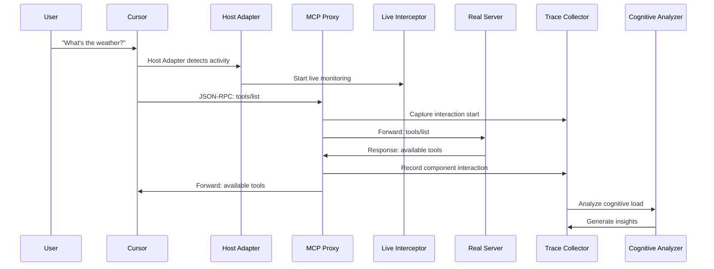

# MCP Usability Audit Agent - Current Architecture 
## Proxy-Based Real-Time MCP Communication Monitoring


---

## 🎯 **Why Proxy Architecture?**

**The Challenge**: Direct interception of MCP stdio communications proved infeasible due to:
- MCP servers use subprocess stdio communication (stdin/stdout)
- No direct access to message streams without modifying host applications
- Security and permission constraints in host environments

**The Solution**: Transparent proxy approach that:
- ✅ **Intercepts all MCP communications** without host modification
- ✅ **Captures real JSON-RPC messages** in real-time
- ✅ **Maintains transparency** - users get identical functionality
- ✅ **Works universally** with any MCP server and host

---

## 🔧 **Advanced Implementation Features**

### **Multi-Host Adapter System**

The implementation includes a sophisticated adapter pattern for supporting multiple MCP hosts:

```python
# Universal host abstraction
class HostAdapter(ABC):
    async def detect_environment(self) -> bool
    async def stream_mcp_messages(self) -> AsyncGenerator[MCPMessageTrace, None]
    async def get_connected_servers(self) -> List[str]

# Host-specific implementations
class CursorAdapter(HostAdapter)      # Cursor IDE integration
class ClaudeDesktopAdapter(HostAdapter)  # Claude Desktop support
class MockHostAdapter(HostAdapter)   # Testing and demos
```

**Benefits:**
- ✅ **Universal compatibility** across MCP hosts
- ✅ **Host-specific optimizations** 
- ✅ **Easy extension** to new hosts
- ✅ **Unified interface** for monitoring

### **Advanced Component Tracing**

Beyond basic message capture, the system includes comprehensive component interaction tracing:

```python
# Component interaction modeling
class ComponentInteraction:
    source_component: ComponentType  # USER_INTERFACE, MCP_HOST, etc.
    target_component: ComponentType
    operation: str
    latency_ms: Optional[int]
    events: List[TraceEvent]

# Request flow tracking  
class RequestFlow:
    interactions: List[ComponentInteraction]
    total_latency_ms: Optional[int]
    critical_path: List[ComponentInteraction]
```

**Capabilities:**
- 🔍 **End-to-end request tracing** across all components
- ⏱️ **Critical path analysis** for performance bottlenecks
- 📊 **Visual timeline generation** of component interactions
- 🎯 **Bottleneck identification** and optimization recommendations

### **Live Process Monitoring**

Real-time interception capabilities beyond static proxy:

```python
class LiveMCPInterceptor:
    async def _monitor_processes(self):  # Process-level monitoring
    async def _trace_process_syscalls(self, pid: int):  # System call tracing
    async def _monitor_network(self):  # Network traffic analysis
```

**Advanced Features:**
- 🔄 **Real-time process discovery** of MCP servers
- 📡 **Network traffic interception** for HTTP-based MCP
- 🔍 **System call tracing** for deeper insights
- 📱 **Live dashboard streaming** of captured data

### **Cognitive Load Analysis Engine**

5-factor cognitive load analysis with industry-standard methodology:

```python
class CognitiveAnalyzer:
    def _calculate_prompt_complexity(self) -> float      # Query complexity analysis
    def _calculate_context_switching(self) -> float      # Cognitive switching cost
    def _calculate_retry_frustration(self) -> float      # Failure impact analysis
    def _calculate_configuration_friction(self) -> float # Setup difficulty
    def _calculate_integration_cognition(self) -> float  # Integration complexity
```

**Research-Based Metrics:**
- 🧠 **Cognitive Load Theory** implementation (Sweller, 1988)
- 📊 **Weighted scoring** based on UX research
- 🎯 **Actionable recommendations** with estimated improvement
- 📈 **Benchmarking** against industry standards

---

## 🏗️ **Updated System Architecture**

### **Layered Architecture Overview**

```
┌─────────────────────────────────────────────────────────────────┐
│                        CLI Interface                            │
│  mcp-audit proxy | trace | report | monitor | status          │  
├─────────────────────────────────────────────────────────────────┤
│                    Analysis & Reporting Layer                   │
│  CognitiveAnalyzer | ReportGenerator | TraceVisualizer        │
├─────────────────────────────────────────────────────────────────┤
│                    Orchestration Layer                         │
│  MCPUsabilityAuditAgent | TraceCollector | InteractionManager │
├─────────────────────────────────────────────────────────────────┤
│                    Interception Layer                          │  
│  MCPProxy | LiveMCPInterceptor | NetworkMonitor              │
├─────────────────────────────────────────────────────────────────┤
│                    Host Adaptation Layer                       │
│  CursorAdapter | ClaudeDesktopAdapter | BaseHostAdapter      │
├─────────────────────────────────────────────────────────────────┤
│                    Data Models & Storage                       │
│  MCPMessageTrace | ComponentInteraction | UsabilityReport    │
└─────────────────────────────────────────────────────────────────┘
```

### **Enhanced Message Flow**



---

## 📁 **Enhanced File System Layout**

```
~/.cursor/
├── mcp.json                           # Modified with proxy commands
├── mcp_audit_messages.jsonl           # Captured JSON-RPC messages  
├── mcp_audit_proxy.log               # Proxy operation logs
├── mcp_audit_trace_data.jsonl        # Component interaction traces
└── mcp.json.backup                   # Original configuration backup

./reports/
├── component_trace_YYYYMMDD_HHMMSS.json    # Component interaction analysis
├── usability_report_YYYYMMDD_HHMMSS.json   # Cognitive load analysis  
├── integrated_report_YYYYMMDD_HHMMSS.json  # Combined insights
└── live_dashboard_data/                     # Real-time dashboard data

./cache/
├── host_detection_cache.json          # Host environment detection cache
├── server_capabilities_cache.json     # MCP server capabilities cache
└── performance_baselines.json         # Performance baseline data
```

---

## 🎯 **Implementation Status vs. Architecture**

| Component | Architecture Doc | Implementation | Status |
|-----------|-----------------|----------------|---------|
| Basic Proxy | ✅ Documented | ✅ Implemented | ✅ **Complete** |
| Message Capture | ✅ Documented | ✅ Implemented | ✅ **Complete** |
| CLI Interface | ✅ Documented | ✅ Implemented | ✅ **Complete** |
| Host Adapters | ❌ Not documented | ✅ Implemented | 🔄 **Update Docs** |
| Live Monitoring | ❌ Not documented | ✅ Implemented | 🔄 **Update Docs** |
| Component Tracing | ❌ Not documented | ✅ Implemented | 🔄 **Update Docs** |
| Cognitive Analysis | ⚠️ Basic mention | ✅ Advanced implementation | 🔄 **Update Docs** |
| Visual Analytics | ❌ Not documented | ✅ Implemented | 🔄 **Update Docs** |

**Conclusion**: The implementation is **significantly more advanced** than documented. The architecture document should be updated to reflect the sophisticated multi-layered system that has been built. 