# Cognitive Observability Agent Documentation

## What is Cognitive Observability?

**Cognitive Observability** is a one of its kind approach to monitoring AI agent interactions that goes beyond traditional technical metrics to focus on **human cognitive load** and **user experience**. While conventional observability tools track system performance (latency, throughput, errors), cognitive observability measures how well AI agents support human cognition and workflow.

### Key Differentiators

| Traditional Observability | Cognitive Observability |
|---------------------------|-------------------------|
| System performance metrics | User cognitive load analysis |
| Technical error tracking | Usability friction detection |
| Infrastructure monitoring | AI agent UX optimization |
| Generic latency/throughput | Context-aware interaction quality |
| Post-incident analysis | Proactive UX improvement |

### Core Principles

1. **Human-Centered Metrics**: Measure cognitive burden, not just system load
2. **Context-Aware Analysis**: Understand user intent and workflow disruption  
3. **Proactive UX Optimization**: Identify usability issues before they impact users
4. **AI Agent Specific**: Tailored for LLM interactions, tool usage patterns, and reasoning quality
5. **Real-time Feedback**: Continuous monitoring of cognitive health

## The 5-Point Cognitive Analysis Framework

Our cognitive observability agent evaluates AI agent interactions across **five critical cognitive dimensions**:

### 1. 🧠 **Prompt Complexity Score**
- **What it measures**: Cognitive load from complex or ambiguous prompts
- **Indicators**: Lengthy prompts, multiple instructions, unclear requirements
- **Impact**: High complexity increases user mental effort and error rates
- **Optimization**: Suggest prompt simplification and clearer structure

### 2. 🔄 **Context Switching Score** 
- **What it measures**: Mental overhead from jumping between different tools/contexts
- **Indicators**: Frequent tool changes, multi-step workflows, scattered information
- **Impact**: Context switching reduces focus and increases cognitive fatigue
- **Optimization**: Recommend workflow consolidation and tool grouping

### 3. 🔁 **Retry Frustration Score**
- **What it measures**: User frustration from failed attempts and repeated interactions
- **Indicators**: Multiple retries, error patterns, abandoned workflows
- **Impact**: Retries compound cognitive load and reduce trust in AI agents
- **Optimization**: Improve error handling and success rate

### 4. ⚙️ **Configuration Friction Score**
- **What it measures**: Cognitive overhead from complex setup and configuration
- **Indicators**: Setup complexity, unclear documentation, configuration errors
- **Impact**: High friction creates barriers to adoption and usage
- **Optimization**: Streamline onboarding and auto-configuration

### 5. 🔗 **Integration Cognition Score**
- **What it measures**: Mental effort required to understand tool integrations
- **Indicators**: Integration complexity, unclear tool relationships, workflow confusion
- **Impact**: Poor integration understanding limits effective tool usage
- **Optimization**: Improve tool discovery and relationship clarity

### Scoring System

Each dimension is scored on a **0-100 scale**:
- **0-40**: 🔴 **High Cognitive Load** - Significant UX issues requiring immediate attention
- **41-70**: 🟡 **Moderate Load** - Room for improvement, monitor trends  
- **71-100**: 🟢 **Low Load** - Good UX, maintain current patterns

**Overall Cognitive Score** = Weighted average of all five dimensions with contextual adjustments.

## Installation and Setup Guide

### Prerequisites
- Python 3.8+
- Cursor IDE with MCP server configuration
- pip3 package manager


### Fresh Build Installation

```bash
# Clean installation from source
cd mcp-useability-audit-agent

# Remove existing installation
pip3 uninstall mcp-audit-agent -y # optional

rm -rf ~/.mcp-audit
rm -f ~/.cursor/mcp_audit_messages.jsonl

# Fresh build and install
pip3 install -e .
python3 -m build

# Verify and start

mcp-audit proxy &

# Restart Cursor to activate the proxy
```

### Quick Installation

```bash
# 1. Install the agent
pip3 install -e .

or
cd ./dist/ && pip3 install mcp_audit_agent-0.1.0.tar.gz

# 2. Verify installation
mcp-audit --help

# 3. Check integration status (auto-configures OpenTelemetry)
mcp-audit integrate status

# 4. Start cognitive observability monitoring
mcp-audit proxy

# 5. Restart Cursor to activate the proxy
```

### Docker Observability Stack

```bash
# Start complete monitoring stack
docker-compose -f docker-compose.observability.yml up -d

# Access dashboards
open http://localhost:3000  # Grafana
open http://localhost:16686 # Jaeger  
open http://localhost:9090  # Prometheus
```

### Configuration

The agent auto-creates configuration at `~/.mcp-audit/integrations.json`:

```json
{
  "opentelemetry": {
    "service_name": "mcp-audit-agent",
    "jaeger_endpoint": "http://localhost:14268/api/traces",
    "prometheus_port": 8889,
    "enabled": true,
    "real_time_export": true,
    "export_interval_seconds": 5
  }
}
```

### Accessing Cognitive Metrics

- **Prometheus Metrics**: `http://localhost:8889/metrics`
- **Report Generation**: `mcp-audit report --type usability`
- **Proxy Status**: `mcp-audit proxy-status`

## How the Agent Works: MCP Proxy Architecture

```mermaid
graph TB
    subgraph "User Environment"
        U[👤 User] --> C[🖥️ Cursor IDE]
    end
    
    subgraph "Cognitive Observability Layer"
        C --> P[🔍 MCP Audit Proxy]
        P --> CI[🧠 Cognitive Interceptor]
        CI --> CA[📊 Cognitive Analyzer]
        CA --> IM[🔗 Integration Manager]
    end
    
    subgraph "MCP Protocol Layer"
        P --> MC[📡 MCP Client]
        MC --> MS1[🔧 MCP Server 1]
        MC --> MS2[⚡ MCP Server 2] 
        MC --> MS3[🌐 MCP Server N]
    end
    
    subgraph "Observability Stack"
        IM --> OT[📈 OpenTelemetry]
        OT --> PR[📊 Prometheus]
        OT --> JA[🔍 Jaeger]
        PR --> GR[📋 Grafana]
    end
    
    subgraph "Data Storage"
        CI --> JL[📝 JSONL Logs]
        CA --> UR[📊 Usability Reports]
    end
    
    style P fill:#e1f5fe
    style CI fill:#f3e5f5
    style CA fill:#e8f5e8
    style IM fill:#fff3e0
```



### Architecture Flow

#### 1. **Proxy Interception**
- Agent sits between Cursor and MCP servers as transparent proxy
- Captures all MCP protocol messages bidirectionally
- Zero impact on existing MCP server functionality

#### 2. **Cognitive Analysis Pipeline**

```
Raw MCP Messages → Cognitive Interceptor → Timeline Analysis → 5-Point Scoring → Usability Reports
```

- **Message Capture**: Every LLM↔MCP interaction logged with timestamps
- **Context Correlation**: Groups related messages into user workflows  
- **Cognitive Scoring**: Applies 5-point framework to interaction patterns
- **Real-time Export**: Streams metrics to observability stack

#### 3. **Multi-Channel Output**

| Output Channel | Purpose | Update Frequency |
|---------------|---------|------------------|
| **JSONL Logs** | Raw interaction data | Real-time |
| **Prometheus Metrics** | 290+ cognitive metrics | Every 5 seconds |
| **Usability Reports** | Detailed analysis | On-demand |
| **Jaeger Traces** | Distributed tracing | Real-time |
| **Grafana Dashboards** | Visual monitoring | Real-time |

#### 4. **Cognitive Metrics Available**

**Real-time Metrics (290+ total):**
```bash
# Cognitive Load Analysis
mcp_cognitive_load_score{component="prompt_complexity"} 80.0
mcp_cognitive_load_score{component="context_switching"} 90.0
mcp_cognitive_load_score{component="retry_frustration"} 85.0

# Usability & Performance  
mcp_usability_score{server="mastra"} 193.33
mcp_flow_success_rate_percent 100.0
mcp_abandonment_rate_percent 0.0

# AI Agent Specific
mcp_llm_decisions_total 132.0
mcp_tool_calls_total 33.0  
mcp_usability_grade_total{grade="A"} 11.0
```

### Key Benefits

1. **Zero Configuration**: Auto-discovers and monitors any MCP server
2. **Non-Intrusive**: Transparent proxy with no MCP server modifications needed
3. **Comprehensive**: Covers technical performance + cognitive load + user experience
4. **Production Ready**: Full OpenTelemetry integration with Prometheus/Grafana
5. **Actionable Insights**: Specific recommendations for UX improvement


Supports direct integration with:
- **Mixpanel**: User behavior analytics
- **PostHog**: Product analytics  
- **LangSmith**: LLM observability
- **Custom APIs**: RESTful cognitive metrics export

---


**🧠 Transform your AI agent monitoring from technical metrics to cognitive insights!**
